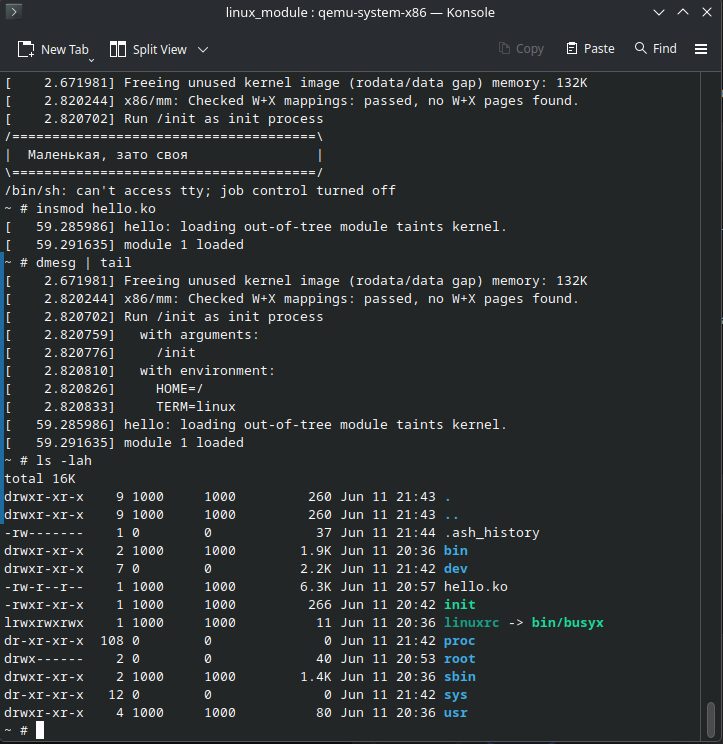

# Yet Another Hello

Собрал ядро Linux, initramfs на BusyBox, загрузил в QEMU и загрузил кастомный модуль



## Команды

```bash
# ядро:
make defconfig
make -j$(nproc) bzImage

# модуль:
make

# QEMU:
qemu-system-x86_64 -kernel linux-7.1-rc7/arch/x86/boot/bzImage -initrd initramfs.cpio.gz -nographic -append console=ttyS0

# тест:
insmod hello.ko
dmesg | tail
```
# код модуля:
```c
static int __init hello_init(void) {
    printk(KERN_INFO "module loaded\n");
    return 0;
}
```